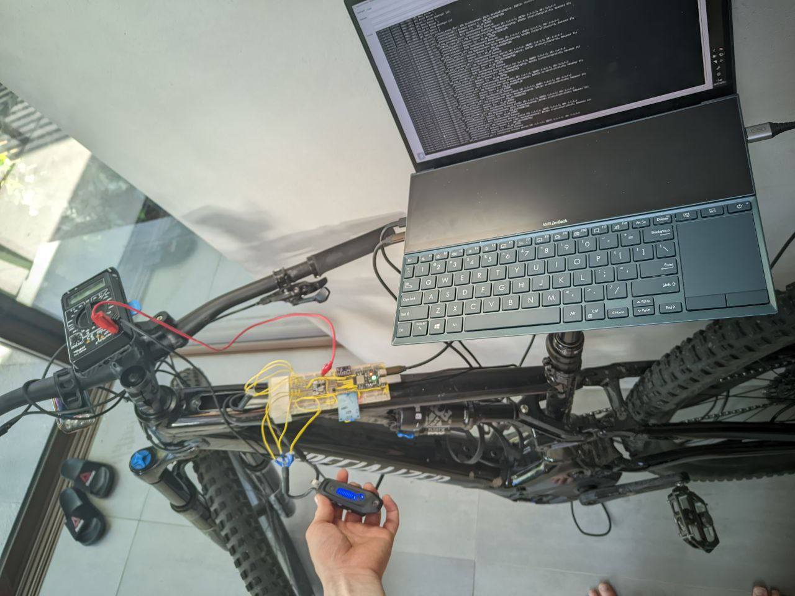
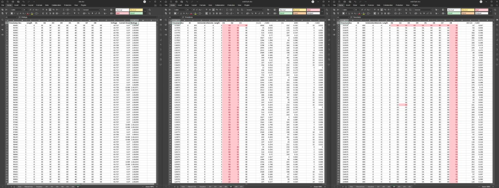

<!-- Discuss the reverse modeling techniques used, what I found out about the data, the protocol and encoding used.  -->

# OpenTCU CAN Bus Decoding
This document contains an overview of the process taken to reverse engineer the CAN bus recordings and discoveries about the data that is sent on the bus.  
*The reversed data section is still under active development and will be updated as more data is discovered.*

- [OpenTCU CAN Bus Decoding](#opentcu-can-bus-decoding)
  - [Recording Setup](#recording-setup)
  - [Data Analysis Process](#data-analysis-process)
  - [Reversed Data](#reversed-data)
    - [100](#100)
    - [101](#101)
    - [201](#201)
    - [300](#300)
    - [401](#401)
    - [404](#404)

## Recording Setup
Before I started working on the main software component of this project I wrote a simple program that would relay and log all messages read on the CAN bus. I then placed the my hardware between the TCU and the rest of the e-bike system and started to record data to my laptop via a usb-to-serial connection. On the laptop I had a powershell script running that would capture all CAN bus related messages and format them into a CSV file that I could then further process later.  
  

## Data Analysis Process
For each of the recorded CSV files I captured the timestamp, bus direction, message ID, message length, and data bytes. My process for reverse engineering the data was very manual, looking at the data and trying to pick out values that would change when I interacted with the bike, with the spreadsheet highlighting changes in data to make it easier to spot. I would then try to correlate these changes with the data that I was seeing on the Specalized app, the recordings from the app were saved as both FIT files and screen recordings, I then took the timestamps of each of these files and lined them up to help me align the data I was looking at.  
Initially there was not too much success with this, looking at the data by eye for recognized values, while I was able to figure out what ID's related to motor and wheel data I couldn't figure out what the data meant. During my time researching for details about the bike I came across [a post](https://www.pedelecforum.de/forum/index.php?threads/analyse-ladevorgang-und-akku-can-nachrichten-am-levo-2019.60168/) on a German forum that was discussing the reverse engineering of the battery for the bike. Within this post a document was posted that gave me a major lead in decoding the data. They had mentioned that a lot of the data was encoded in a little-endian format and that certain values related to the battery used twos-complement.  
With this new found information I setup the spreadsheet to display each of the hexadecimal data fields as numbers using HEX2DEC and CONCAT to combine bytes, for each of the data fields I display 8, 16 and 32 bit representations of the data. It was then a similar process of looking at the data and trying to correlate it with the data that I was seeing on the app.  
  

I spent a long time trying to figure out the data this way, however I could only get so far as the client application only lets end users customize so much about the bike. In order to change some of the more restricted settings I would need access to the Turbo Studio application which is only authenticated to Specialized dealers. I had decided to take my bike to get a dealer to ring diagnostics on the bike as this would mean they plug the bike into the Turbo Studio application and I could then record the data that was sent to the bike. From this I discovered a few more ID's that I had not seen before and was able to find some of the codes for hidden settings.  
I also know that the Turbo Studio application can perform firmware updates on the bike. One idea for the future would be to capture this firmware update so that I could potentially use this as a base for reverse engineering the firmware of the TCU and motor.

## Reversed Data
This part of the document contains the currently discovered data codes that are sent over the CAN bus.  
All data codes are in hexadecimal format.

### 100
- **Origin:** TCU
- **Length:** 3 or 8
- **Use:** Send and request configuration data.

**Known messages**
- `05`, `2E`, `02`, `06`, `**`, `**`, `00`, `00`  
  Sets the wheel circumference in millimeters  
  `**` is the value to be set, in little-endian format.  
  Example: 2160mm (default) -> `0870` -> `70`, `08`  
  Requires a bike system restart to take effect.

<!-- Not strictly for a string request. -->
- `03`, `22`, `02`, `*A`, `00`, `00`, `00`, `00`  
  Gets a string.  
  `*A` is the string ID. Below is a table of known string codes.
  | ID   | Key |
  |------|--------|
  | `02` | Motor serial number |
  | `03` | Motor hardware ID |
  | `04` | Bike serial number |
  
  See [string response](#str_response) for the response.

- `30`, `00`, `00`  
Continuation of a request for string data.

- `03`, `22`, `02`, `06`, `00`, `00`, `00`, `00`
  Gets the wheel circumference in millimeters.
  See [get wheel circumference response](#get_wheel_circumference_response) for the response.

### 101
- **Origin:** Other
- **Length:** 8
- **Use:** Provide configuration data.

**Known messages**

- `10`, `*A`, `62`, `02`, `*B`, `**`, `**`, `**`  
  Response to a [request for a string](#str_request).  
  `*A` unknown.  
  `*B` the ID that the string is associated with.  
  `**` is the string data.  
  Requires a [continuation message](#cont_100) to get the full string, the remaining data is sent in the [continuation response](#str_response_cont).

- `21`, `**`, `**`, `**`, `**`, `**`, `**`, `**` | `22`, `**`, `**`, `**`, `**`, `**`, `**`, `**` | `23`, `**`, `**`, `**`, `*A`, `*A`, `*A`, `*A`  
  Continuation data for a request for a string.  
  D0 is always `21`, `22` or `23`, possibly indicating the order of the data.  
  `**` the string characters, this is null terminated when the string is complete, unless the string fills all bits.  
  `*A` seems to be a set of bits that appears to indicate the end of the data frames.  

- `05`, `62`, `02`, `06`, `**`, `**`, `E0`, `AA`
  Response to a [request for the wheel circumference](#get_wheel_circumference_request).  
  `**` is the wheel circumference in millimeters (little-endian).  
  Example: `70`, `08` -> `0870` -> 2160mm.

<!-- 03,6E,02,06,E0,B3,F8,02 | Confirmation response to set wheel circumference message. -->

### 201
- **Origin:** Motor
- **Length:** 5
- **Use:** Live information about the drive system.

D1 and D2 combined contain the speed of the bike in km/h * 100 (little-endian).  
Example: `EA`, `01` -> `01EA` -> 490 -> 4.9km/h.

D6 possibly contains the motion state of the bike. Recordings show that it is `62` when the bike is stationary and `63` when the bike is moving.

### 300
- **Origin:** TCU
- **Length:** 8
- **Use:** Send runtime commands and configuration.

D1 possibly the motor power mode. `00` off, `01` low, `02` medium, `03` high.
D2 controls the walk mode. `5A` disables walk mode, `A5` enables walk mode.
D5 ease setting, `00` to `64`.
D7 maximum motor power setting, `00` to `64`.
<!-- D8 possibly system clock. -->

### 401
- **Origin:** Battery
- **Length:** 8
- **Use:** Battery power information.

D1 and D2 combined contain the battery voltage in mV (little-endian).  
Example: `35`, `9F` -> `9F35` -> 40757mV -> 40.757V.

D5, D6, D7 and D8 combined contain the battery current in mA (little-endian with two's complement).  
Example 1: `46`, `00`, `00`, `00` -> `00 000046` -> 70mA -> 0.07A.  
Example 2: `5B`, `F0`, `FF`, `FF` -> `FF FFF05B` -> -4005mA -> -4.005A.  
The value is positive when discharging and negative when charging.

### 404
- **Origin:** TCU

**Known messages**
- `02`, `30`, `50`, `00`, `01`  
  Enable battery charge limit.

- `02`, `30`, `00`, `00`, `00`
  Disable battery charge limit.

<!-- TODO:
TCU uses 402 for charge% and battery health.
203 contains data for cadence and motor power.
Rider power seems to need both 201 and 203.
-->
