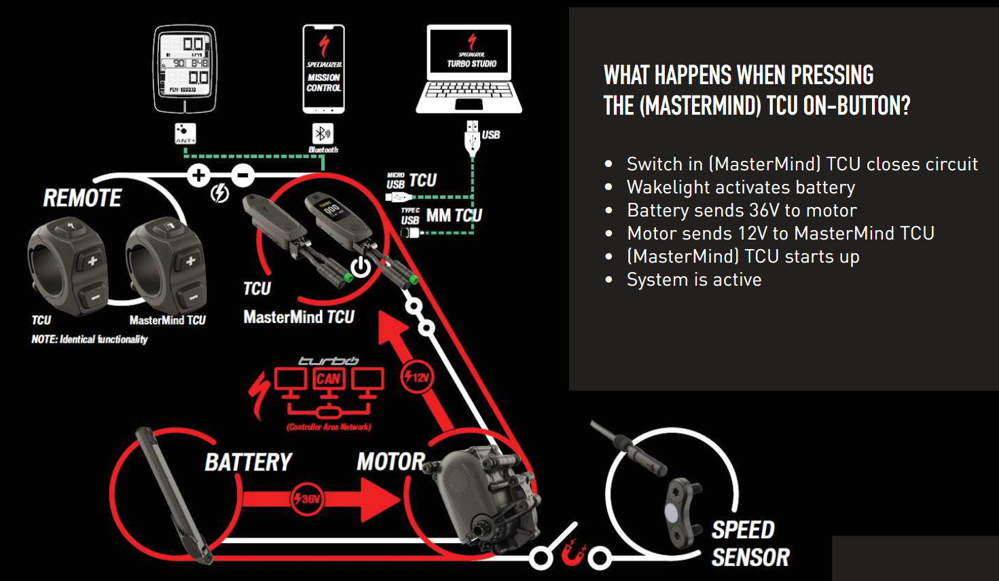
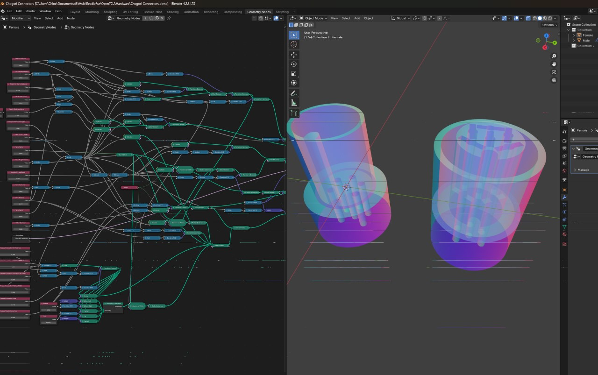

<!-- Discuss reverse modeling techniques. -->
<!-- Mention the places researched for insight on the hardware protocols. -->

# OpenTCU Hardware
This section contains a brief overview of files and discoveries made about the hardware of the TCU and the reverse engineered models that are used in this project.  
This directory contains all the hardware related files and images (such as dimensions and TCU hardware) for the OpenTCU project.

- [OpenTCU Hardware](#opentcu-hardware)
  - [Hardware Breakdown](#hardware-breakdown)
    - [System Overview](#system-overview)
    - [Methodology](#methodology)
  - [Reverse Engineering](#reverse-engineering)
    - [CAN Bus Wiring](#can-bus-wiring)
    - [Chogori Connector](#chogori-connector)
  - [OpenTCU Hardware](#opentcu-hardware-1)
    - [PCB Design](#pcb-design)
    - [Electrical Components](#electrical-components)
    - [OpenTCU Device Images](#opentcu-device-images)

## Hardware Breakdown
### System Overview
The Turbo Control Unit (TCU) is the computer that manages the motor and battery of the bike, its purpose is to gather metrics about the system and configure components based on user preferences.  
Within the TCU system there is the Mastermind TCU, motor, and battery.  
Through some research online the engineers workbook for the Turbo Levo was found, this document contains a lot of information on the mechanical properties of the bike and hints at the electrical properties. From this it was stated that the TCU system uses the CAN bus protocol to communicate between the components.  
  

### Methodology
When starting this project I had the idea of attempting to extract the firmware from the TCU, I started out by opening the TCU and looking for any debug ports or JTAG headers, however, with my limited hardware knowledge I was unable to find any or risk damaging the TCU, though I did notice some contact pads that look like they could be for debugging or JTAG, however the chip likley has it'd firmware encrypted as after looking up the silkscreen on the chip I found it supports firmware encryption and secure boot.  
This may be something I revisit in the future, however it will be difficult because through working on this project it appears the TCU plays less of a vital role in the system than I had originally thought, with the motor being the main component that manages the system instead of the TCU providing the motor with instructions, rather the TCU just provides the motor with configuration data.  

With my inability to extract the firmware I decided to focus on using the method that other third party groups have used to communicate with the TCU, acting as a man in the middle (MITM) between the TCU and the motor. This would be a much easier option too because we know the protocol that the TCU uses to communicate with the rest of the system and the TCU can be unplugged from the rest of the system allowing us easy access to the CAN bus wires without having to permanently modify the wiring of the bike.  

As mentioned in the project overview the goal of this project is to eventually fully reverse engineer the TCU so that the bike can operate without the original TCU, both methods of either extracting the firmware or MITM will be useful in achieving this goal as it helps us understand the data that is being sent between the TCU and the motor.

## Reverse Engineering
### CAN Bus Wiring
The TCU is connected to the rest of the system through a 6-pin proprietary connector manufactured by Chogori Technologies. In the previously mentioned document it is stated that the TCU is provided 12V by the motor. Further researching the CAN bus protocol, there should be 2 data lines, CANH and CANL, which both run at around 2.5V. To figure out the pinout of the connector. I probed each of the wires with a multimeter, and with the provided information found that the pinout is as follows:  

This only tells us part of the wiring though, while we now know which pins are VCC, GND, CANH/L, there is another mystery pin and we are still unsure at this point which CAN wire is high and low.  
I first decided to figure out what the unknown pin was for, reading back on the handbook it states that the TCU closes a circuit which triggers the system to turn on, from this I assumed that this wire was the power switch, so while the system was off, I connected this pin to ground through a resistor and the system turned on.  
The next step was to figure out which CAN wire was high and low, to do this I probed the two CAN lines with a digital analyzer and recorded the data on the wires to the Saleae logic software. At this time the data speed was unknown, within the CAN bus protocol there are certain frames that are always 1 bit wide, for example the start of frame bit, knowing that this is 1 bit wide I can measure the time between the start of frame bit and the next bit to determine the speed of the data. The discovered data rate fell very close to one of the standard data rates of the CAN bus protocol, 250kbps. Then to find which wire was the high line I can just analyze the data to see which wire is high when data is known to be high as the other line should be low.  
With these discoveries I was able to determine the final pinout of the connector and data rate of the CAN bus being 250kbps.  

### Chogori Connector
Since working on this project I have found where the official connectors can be sourced from, however they are not cheap. Before knowing where to source the connectors I had decided to model the connectors myself so that they could be 3D printed.  
In order to do this I took various measurements of the connector and had recreated it inside of Blender using geometry nodes so that I could easily tweak parameters to adjust the connector to fit the TCU.  
*When I get back to working on the connectors I will tidy up the geometry node graph as it is very messy right now.*  
  
Getting this model to fit the plugs required a lot of trial and error, printing and adjusting the model until it fit perfectly. I have since managed to print a connector that fits the plugs. The female plug appears different as I decided to use standard female header pins that could be inserted into the female plug after printing to reduce complexity, however this did mean that the tolerances in the print had to be much more accurate, which seems to be a problem with my current resin printer settings due to how small some of the connector holes are resulting in resin curing inside the small holes.

## OpenTCU Hardware
In order to undergo the MITM method of communication with the system I needed to create a device that would sit on the CAN bus and then read/write messages to the bus. Because the OpenTCU were to act as a man in the middle instead of just another device on the bus it had to be able to intercept messages from the TCU and motor and then relay them to the other device. This has various uses which will be discussed in the software section of this project.  

Size is a very important factor for this device as the space inside the bike is very limited so it is important that the device is as small as possible.

### PCB Design
Due to my lack of knowledge in electronics I am unable to create a custom board for this project so instead I have attempted to make the OpenTCU as small as possible using off the shelf development boards.  
The current PCB design is rather simple and is designed to have development boards soldered to it instead of individual components. The footprint of the total device is kept minimal by having designed the PCB to have components on both sides.

### Electrical Components
I have switched microcontrollers a few times throughout this project, originally I used the ESP32-C3 for it's compact size, however I found that, at least for development, with my logging and the speed of data on the bus it would have to drop frames for being too slow. I then switched to the ESP32-S3, a much more powerful chip with a slightly increased footprint, while this chip was able to keep up with the data on the bus, it was far overpowered for this project and was also more expensive. I then came across the ESP32-C6, a chip that is slightly more powerful than the C3 but equally as small while still being cheaper than the S3. However the major seller for the C6 was that it had two TWAI controllers.  
This was extremely compelling because most other ESP32 chips only have one CAN controller which meant in order to support two buses I had to use a MCP2515 chip which drastically increased the size of the device, by having two controllers on the chip I could reduce the size of the device and use two of the much smaller CJMCU-1051 boards for the CAN transceivers.  
The CAN transceivers and microcontroller both require 5V power, however the bike only provides 12V power, so a buck converter is required to step down the voltage to 5V.

### OpenTCU Device Images
Below are two images of the current revision (V3) of the OpenTCU device:  
*Due to not being able to replicate my good connector print this example of the board has to have each wire manually connected to the bike instead of via the printed connector.*  

